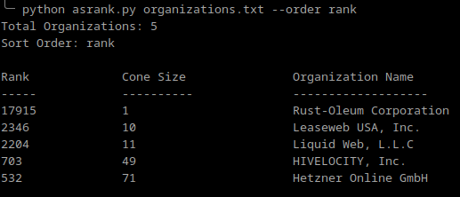
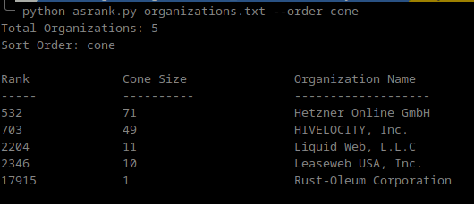

# ASRank

This is a script to query [ASRank API](https://asrank.caida.org/) with organizations which will return:

* Organization's Name
* ASRank
* Cone Size

## Setup
`pip install -r requirements.txt`

## Usage

1. The file `organization.txt` is a list of the following organizations:
    * Liquid Web
    * OVH
    * Hivelocity
    * Hetzner
    * LeaseWeb

2. `python asrank.py  [--order [rank][cone]] filename`

    Order is an optional argument that will sort the organizations based on either rank or cone size in *desending* order. Order defaults to `rank` if left blank.

## Examples
* `python asrank.py organizations.txt --order cone`
* `python asrank.py organizations.txt --order rank`

